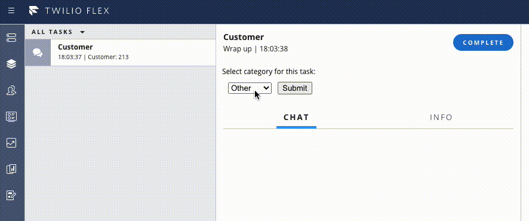
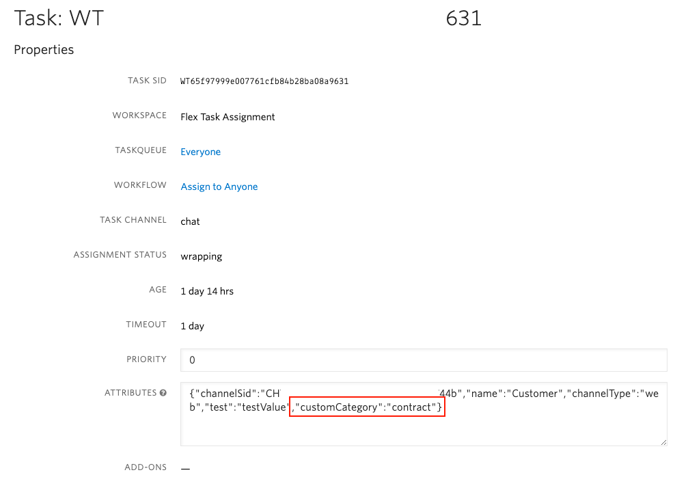

# Custom task category Plugin on Task Wrapping

This Twilio Flex Plugin enables your agents to set a custom category for a task in wrapping state.

To learn more about developing plugins on your Flex instance, refer to the [getting started guide](https://www.twilio.com/docs/flex/quickstart/getting-started-plugin).

---

The plugin adds dropdown select and Submit button which, when clicked, updates task attributes.
## Screenshots
Set category:



Updated task attributes:



## Setup

Make sure you have [Node.js](https://nodejs.org) as well as [`npm`](https://npmjs.com) installed.

Afterwards install the dependencies by running `npm install`:

```bash
cd plugin-add-category-on-wrap-up

# If you use npm
npm install
```

## Development

In order to develop locally, you can use the Webpack Dev Server by running:

```bash
twilio flex:plugins:start
```

This will automatically start up the Webpack Dev Server and open the browser for you. Your app will run on `http://localhost:3000`. If you want to change that you can do this by setting the `PORT` environment variable:

```bash
PORT=3001 twilio flex:plugins:start
```

When you make changes to your code, the browser window will be automatically refreshed.

Type `twilio flex:plugins:start --help` to get more detailed information about the command.

## Deploy and Release Plugin

When you are ready to deploy your plugin, in your terminal run:

_Note: Make sure to set your profile correctly in package.json: --profile %YOUR_PROFILE_NAME%_

```bash
npm run deploy
```

This will upload your plugin to Flex. After a deploy, your plugin is not yet enabled for all your users on your Flex application. You need to run the release command after the deploy to enable any changes:

Note: Make sure to set your profile correctly in package.json: --profile %YOUR_PROFILE_NAME%

```bash
npm run release
```

For more details on deploying your plugin, refer to the [deploying your plugin guide](https://www.twilio.com/docs/flex/developer/plugins/cli/deploy-and-release).

Note: Common packages like `React`, `ReactDOM`, `Redux` and `ReactRedux` are not bundled with the build because they are treated as external dependencies so the plugin will depend on Flex to provide them globally.

## Contributors ✨
Contributions of any kind welcome!